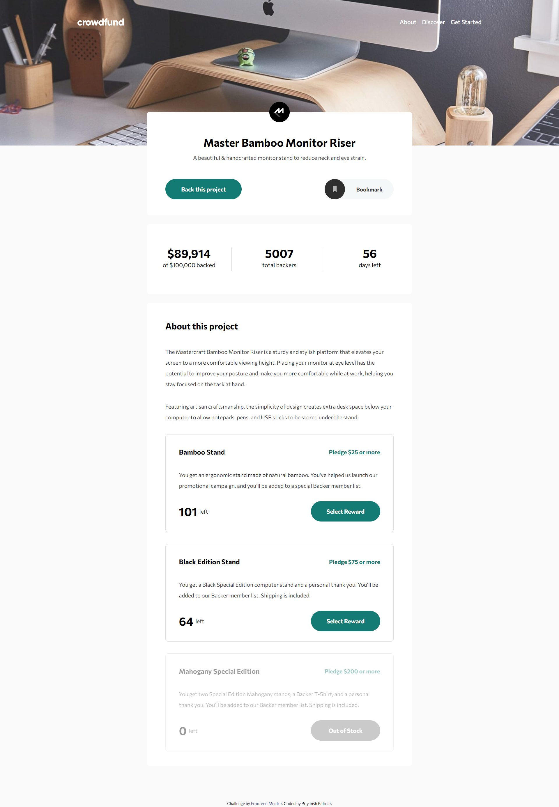

# Frontend Mentor - Crowdfunding product page solution

This is a solution to the [Crowdfunding product page challenge on Frontend Mentor](https://www.frontendmentor.io/challenges/crowdfunding-product-page-7uvcZe7ZR). Frontend Mentor challenges help you improve your coding skills by building realistic projects.

## Table of contents

- [Overview](#overview)
  - [The challenge](#the-challenge)
  - [Screenshot](#screenshot)
  - [Links](#links)
- [My process](#my-process)
  - [Built with](#built-with)
  - [What I learned](#what-i-learned)
  - [Continued development](#continued-development)
  - [Useful resources](#useful-resources)
- [Author](#author)
- [Acknowledgments](#acknowledgments)

<!-- **Note: Delete this note and update the table of contents based on what sections you keep.** -->

## Overview

### The challenge

Users should be able to:

- View the optimal layout depending on their device's screen size
- See hover states for interactive elements
- Make a selection of which pledge to make
- See an updated progress bar and total money raised based on their pledge total after confirming a pledge
- See the number of total backers increment by one after confirming a pledge
- Toggle whether or not the product is bookmarked

### Screenshot



<!-- **Note: Delete this note and the paragraphs above when you add your screenshot. If you prefer not to add a screenshot, feel free to remove this entire section.** -->

### Links

- Solution URL: [View Code on github](https://github.com/priyansh32/priyansh32.github.io/tree/main/crowdfunding-product-page-main)
- Live Site URL: [Click here](https://priyansh32.github.io/crowdfunding-product-page-main/)

### Built with

- Semantic HTML5 markup
- CSS custom properties
- Flexbox
- SCSS
- Desktop-first workflow

<!-- **Note: These are just examples. Delete this note and replace the list above with your own choices** -->

### What I learned

i learned creating better responsive sites, also learned some things for better color schemes in websites, and most important I learned working on real life projects

<!-- To see how you can add code snippets, see below: -->

```html
<h1>Some HTML code I'm proud of</h1>
```

```css
.proud-of-this-css {
  color: papayawhip;
}
```

```js
const proudOfThisFunc = () => {
  console.log("🎉");
};
```

<!-- If you want more help with writing markdown, we'd recommend checking out [The Markdown Guide](https://www.markdownguide.org/) to learn more. -->

<!-- **Note: Delete this note and the content within this section and replace with your own learnings.** -->

### Continued development

- This webpage still needs some modifications,I will be doing those soon, as I get some time
- I am now learning React and Nodejs to build more awesome projects in future

<!-- **Note: Delete this note and the content within this section and replace with your own plans for continued development.** -->

### Useful resources

- [Coder Coder](https://www.youtube.com/channel/UCzNf0liwUzMN6_pixbQlMhQ) - This helped me adapting to a real life work style and learned a lot of things from her especially her 'Building a Website from scratch' series. I really learned a lot watching Jessica Chan aka Coder Coder on Youtube.
- [Codegem.io](https://www.instagram.com/codegem.io/) - This is an amazing Instagram page that helps you learn some concepts through simple illustrationa which helped me a lot.
-

<!-- **Note: Delete this note and replace the list above with resources that helped you during the challenge. These could come in handy for anyone viewing your solution or for yourself when you look back on this project in the future.** -->

## Author

- Website - [Priyansh Patidar](https://www.your-site.com)
- Frontend Mentor - [@priyansh32](https://www.frontendmentor.io/profile/priyansh32)
- Twitter - [@PriyanshPatid13](https://www.twitter.com/PriyanshPatid13)
- Instagram - [@priyansh_patidar132](https://www.instagram.com/priyansh_patidar132/)

## Acknowledgments

- [Coder Coder](https://www.youtube.com/channel/UCzNf0liwUzMN6_pixbQlMhQ) and [Codewithharry](https://www.youtube.com/channel/UCeVMnSShP_Iviwkknt83cww) youtube videos and a lot of other free resources available on internet.
